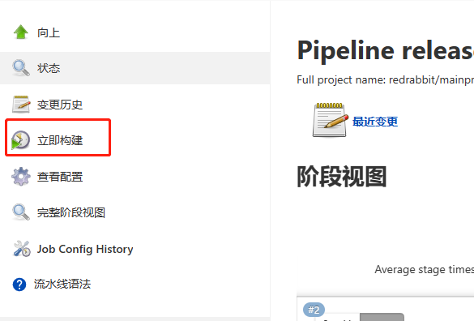
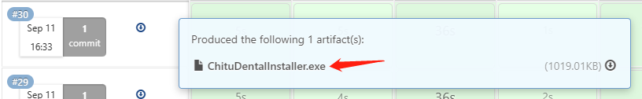
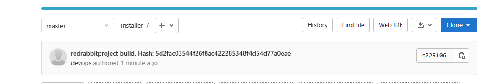
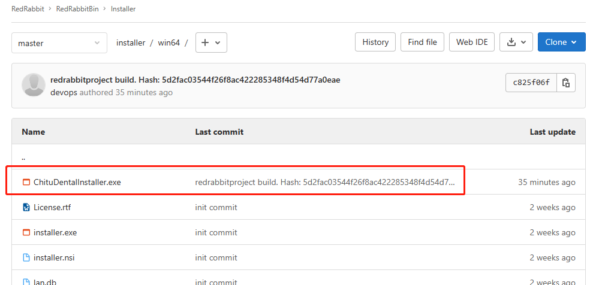

# CI/CD流程文档

## 1. 简介
主工程的jenkins流程，提供持续集成持续交付功能

## 2. 流程概览
整个流程使用jenkins作为CI/CD平台，流程可以通过点击“立即构建”或push到指定的分支的方式触发流程

## 3. 源代码管理
分支策略、代码提交、合并规范等（暂无）

## 4. 代码质量、风格检查
静态代码分析、代码规范、代码风格检查等（暂无）

## 5. 单元测试
单元测试框架和工具，如何编写和运行单元测试（暂无）

## 6. 自动化构建
根据Jenkinsfile脚本来进行自动化构建，整个构建流程分为initialize，checkout，windows build，deploy，pack，post build阶段
- initialize： 变量初始化，获取提交哈希等
- checkout：清理工作目录，获取指定分支的最新提交
- build：对工程进行构建（目前仅针对Windows进行构建）
- deploy：将资源文件和运行时所需库等复制到目标产物的目录下
- pack：使用nsis对目标产物进行打包（目前仅Windows）
- post build：提交成品到jenkins和gitlab上，[gitlab](https://gitlab.chuangbide.com/redrabbit/redrabbitbin/installer)上的成品会是目标产物，目标产物的安装包，同时带有该次提交的哈希信息

### 6.1 构建报告和通知
jenkins会将构建结果等通过邮件或企业微信机器人等方式通知组内成员

### 6.2 构建产物的交付
Jenkins上的成品

[gitlab](https://gitlab.chuangbide.com/redrabbit/redrabbitbin/installer)上的成品

